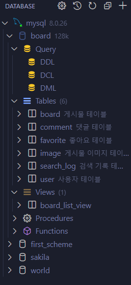

# Spring boot + Reactjs(ts) + MySQL 게시판형 블로그 만들기

## 0. 개발환경 구축
<details>
<summary>
유튜브 링크
</summary>

https://www.youtube.com/watch?v=NTZgPYlassE&list=PLbq5jHjpmq7q-Td2jOXtpf7SD5c53RqXh

</details>

모든 개발 IDE는 vsCode로만 진행할 예정이다.

**Extension 설치**

- Korean Language Pack for Visual Studio Code : 한국어 팩
- Better Comments : 각주를 좀더 눈에 잘띄게
- Color Highlight : 색상 바로 보기
- GitHub Theme : 깃허브 테마(그냥 평소에 쓰던걸 쓰기로함 Material Icon Theme)
- Material Icon Theme : 아이콘 테마
- Git Graph : SourceTree처럼 깃을 시각화하여 볼 수 있음
- Git History : 깃 기록
- GitLens : 누가 어떤 커밋했는지 알려줌
- GitHub Pull Requests and Issues : 누가 Pull Request 했는지 알려줌
- GitHub Repositories : 레포지토리 연결해서 볼 수 있는데 로그인해야함
- Markdown Preview Github Styling : 마크다운 미리보기
- Todo Tree : 각주로 TODO를 적어놓으면 표시되어 뭘 해야할지 알 수 있음


**Java 설치**

https://code.visualstudio.com/docs/java/java-tutorial 에서 운영체제에 맞는 것을 다운받는다. JDK까지 자동으로 설치가 된다.

설치 후, 추가적인 Extension을 설치한다.

- gradle for java
- Spring Boot Extension Pack
- Spring Boot Snippets

**MySQL 설치**

홈페이지에서 MySQL을 설치해준다.

설치 후, 추가적인 Extension을 설치한다.
- mysql(publisher:"Weijan Chen")

왼쪽에 DB모양을 클릭하여 MySQL 설치시 사용했던 비밀번호를 입력하여 새 connection을 만들어준다.(0000)

**Node.js**

홈페이지에서 Node.js를 설치해준다.

설치 후, 추가적인 Extension을 설치한다.
- ES7+ React/Redux/React-Native snippets

## 1-1. 기능 설계 [a]

<details>
<summary>
유튜브 링크
</summary>

https://www.youtube.com/watch?v=bOAV4GeGYHg

</details>

**설계할 것들 적어보기**

메모장을 하나 열어서 설계할 것들을 미리 적어본다.

[인터페이스 설계](./Interface.md)

## 1-2. 기능 설계 [b]

<details>
<summary>
유튜브 링크
</summary>

https://www.youtube.com/watch?v=bOAV4GeGYHg

</details>

**설계할 것들 적어보기**

이어서 설계할 것들을 미리 적어본다.

[인터페이스 설계](./Interface.md)

## 1-3. 기능 설계 [c]

<details>
<summary>
유튜브 링크
</summary>

https://www.youtube.com/watch?v=kuqPBjZgsus&t=21s

</details>

**설계할 것들 적어보기**

이어서 설계할 것들을 미리 적어본다.

[인터페이스 설계](./Interface.md)


## 2-1 ERD / DDL / DCL 작성

<details>
<summary>
유튜브 링크
</summary>

https://www.youtube.com/watch?v=Nd3i_8f8RTw&list=PLbq5jHjpmq7q-Td2jOXtpf7SD5c53RqXh&index=5&t=5s

</details>

**데이터베이스 테이블 구현**

시작하기전 extension 추가할 것이 있다.

- ERD Editor

설치 후 workspace에 새로운 파일을 만들어준다. 이름은 `board.vuerd.json` 이다.(데이터 베이스 명.vuerd.json 형식이다.)

다이어그램을 다 그린 후 위에 데이터베이스 모양의 SQL DDL 아이콘을 클릭하면 쿼리문으로 만들어진 것을 뽑아낼 수 있다.


그 다음 왼쪽에 익스텐션으로 추가한 DB아이콘을 클릭하면 MySQL이 왼쪽에 표시된다.

여기서 + 버튼을 눌러서 DB를 추가해준다. 생성된 SQL파일에 board라는 db를 만들겠다는 코드를 적는다.

```SQL
CREATE DATABASE board;
```

만들어진 board 데이터베이스를 열어보면 첫번째에 'Query'가 있다. 여기에 새로운 'DDL.sql'파일을 만들어 ERD로 만든 쿼리문을 복사해준다.

실행하기 전에 몇가지 항목들을 수작업으로 조정해줄 것이다.

1. "board"와 "image"테이블에 있는 AUTO_INCREMENT 항목 앞에 DEFAULT 라고 적혀있는 것을 지워줄 것이다.
2. "user" 테이블에 "nickname", "tel_number"에 UNIQUE를 추가해줄 것이다. NOT NULL과 COMMENT 사이에 추가해주면 된다.
3. "favorite", "comment"테이블에  "board_number"에서 `DEFAULT AUTO_INCREMENT`를 지워준다.
4. "image"테이블에 "board_number"에서 `AUTO_INCREMENT`를 지워준다.
5. "search_log"테이블에 "sequence"에서 NOT_NULL과 COMMENT 사이에 `AUTO_INCREMENT`를 넣어준다.

조회수와 댓글 수는 쿼리를 통해서 찾아낼 수 있는데 그렇게 하다보면 연산시간이 길어지고 쿼리문이 복잡해지기 때문에 중복을 어느정도 허용하여 만들어주었다.

그런다음 'DDL.sql'에 개발자 유저를 생성해 준다. 

```SQL
CREATE USER 'developer'@'*' IDENTIFIED BY 'P!ssw0rd';
```
그다음 DLC.sql을 하나더 만든 후 아래 코드를 적는다.
```SQL
GRANT SELECT, UPDATE, DELETE, INSERT
ON board.*
TO 'developer'@'*';
```
## 2-1 DML 작성 [a]

<details>
<summary>
유튜브 링크
</summary>

https://www.youtube.com/watch?v=SrxPcd56pYA&list=PLbq5jHjpmq7q-Td2jOXtpf7SD5c53RqXh&index=6

</details>

**회원가입 작성**

새롭게 'DML.sql'을 만들어준다.

comment 댓글 테이블에서 'comment_number'를 눌러주면 sql파일이 나오는데 NOT NULL과 COMMENT 사이에 AUTO_INCERMENT를 넣어줘야한다.

```SQL
-- Active: 1696468643810@@127.0.0.1@3306@board
-- 회원가입
INSERT INTO
user VALUES
('email@email.com', 'P!ssw0rd','nickname', '01012345678', '부산광역시 부산진구', '롯대백화점', null);

-- 로그인
SELECT * FROM user WHERE email = 'email@email.com';

-- 게시물 작성
INSERT INTO
board (title, content, write_datetime, favorite_count, comment_count, view_count, write_email)
VALUES('제목입니다', '내용입니다', '2023-10-06 00:33',0,0,0, 'email@email.com');

-- 게시물 이미지 설정
INSERT INTO image VALUES(1,'url');

-- 댓글 작성
INSERT INTO
comment (content, writer_datetime, user_email, board_number)
VALUES('반갑습니다.','2023-10-06 00:33', 'email@email.com',1);

-- 댓글 작성 추가(select할때 편하게 하기 위해 중복을 허용해 놓음)
UPDATE board SET comment_count = comment_count + 1 WHERE board_number = 1;


-- 좋아요
INSERT INTO
favorite VALUES ('email@email.com', 1);

UPDATE board SET favorite_count = favorite_count + 1 WHERE board_number = 1;

DELETE FROM favorite WHERE user_email = 'email@email.com' AND board_number=1;

UPDATE board SET favorite_count = favorite_count - 1 WHERE board_number = 1;

-- 게시물 수정
UPDATE board SET title = '수정 제목입니다.', content = '수정 내용입니다.' WHERE board_number = 1;

DELETE FROM image WHERE board_number = 1;

--(이미지를 다시 추가해줘야한다.)
INSERT INTO image VALUES(1,'url');

-- 게시물 삭제(순서에 맞게 지워줘야 한다.)
DELETE FROM comment WHERE board_number =1;
DELETE FROM favorite WHERE board_number =1;
DELETE FROM image WHERE board_number = 1;
DELETE FROM board WHERE board_number =1;  
```
이 내용을 적고 실행한다.

## 2-2 DML 작성 [b]

<details>
<summary>
유튜브 링크
</summary>

https://www.youtube.com/watch?v=SrxPcd56pYA&list=PLbq5jHjpmq7q-Td2jOXtpf7SD5c53RqXh&index=7

</details>

**게시물 불러오기**

- `LIMIT` 문법
`LIMIT 5,5`
을 쓰게되면 항목 5번부터 5개까지만 보겠다는 이야기이다.

- '최신게시물 불러오기'부터 '특정유저 게시물 불러오기'까지 코드를 보면 처음부터 아래 `ON B.board_number = I.board_number` 부분까지 모두 동일하다. 중복을 제거하기 위해서 DDL.sql 에 뷰를 하나 만들어줄 것이다.
```SQL
-- 최신 게시물 리스트 불러오기
-- (게시물 상세 말고 리스트를 불러와야한다.)
--(모든 리스트 불러오는 곳이 똑같다는 것을 염두해둬야함)
SELECT
    B.board_number AS board_number,
    B.title AS title,
    B.content AS content,
    I.image AS title_image,
    B.favorite_count AS favorite_count,
    B.comment_count AS comment_count,
    B.view_count AS view_count,
    B.write_datetime AS write_datetime,
    U.nickname AS writer_nickname,
    U.profile_image AS writer_profile_image
FROM board AS B
INNER JOIN user AS U
ON B.writer_email = U.email
LEFT JOIN (SELECT board_number, ANY_VALUE(image) AS image FROM image GROUP BY board_number) AS I
ON B.board_number = I.board_number
ORDER BY write_datetime DESC
LIMIT 5,5;
    
-- 검색어 리스트
SELECT
    B.board_number AS board_number,
    B.title AS title,
    B.content AS content,
    I.image AS title_image,
    B.favorite_count AS favorite_count,
    B.comment_count AS comment_count,
    B.view_count AS view_count,
    B.write_datetime AS write_datetime,
    U.nickname AS writer_nickname,
    U.profile_image AS writer_profile_image
FROM board AS B
INNER JOIN user AS U
ON B.writer_email = U.email
LEFT JOIN (SELECT board_number, ANY_VALUE(image) AS image FROM image GROUP BY board_number) AS I
ON B.board_number = I.board_number
WHERE title LIKE '%수정%' OR content LIKE '%수정%'
ORDER BY write_datetime DESC
LIMIT 0,5;

-- 주간 상위 3
SELECT
    B.board_number AS board_number,
    B.title AS title,
    B.content AS content,
    I.image AS title_image,
    B.favorite_count AS favorite_count,
    B.comment_count AS comment_count,
    B.view_count AS view_count,
    B.write_datetime AS write_datetime,
    U.nickname AS writer_nickname,
    U.profile_image AS writer_profile_image
FROM board AS B
INNER JOIN user AS U
ON B.writer_email = U.email
LEFT JOIN (SELECT board_number, ANY_VALUE(image) AS image FROM image GROUP BY board_number) AS I
ON B.board_number = I.board_number
WHERE B.write_datetime BETWEEN '2023-10-01 00:00' AND '2023-10-06 15:36'
ORDER BY favorite_count DESC, comment_count DESC, view_count DESC, write_datetime DESC
LIMIT 3;

-- 특정유저 게시물 불러오기
SELECT
    B.board_number AS board_number,
    B.title AS title,
    B.content AS content,
    I.image AS title_image,
    B.favorite_count AS favorite_count,
    B.comment_count AS comment_count,
    B.view_count AS view_count,
    B.write_datetime AS write_datetime,
    U.nickname AS writer_nickname,
    U.profile_image AS writer_profile_image
FROM board AS B
INNER JOIN user AS U
ON B.writer_email = U.email
LEFT JOIN (SELECT board_number, ANY_VALUE(image) AS image FROM image GROUP BY board_number) AS I
ON B.board_number = I.board_number
WHERE B.writer_email = 'email@email.com'
ORDER BY write_datetime DESC;
```

<details>
<summary>
완성된 DML
</summary>

```SQL
-- Active: 1696468643810@@127.0.0.1@3306@board
-- 회원가입
INSERT INTO
user VALUES
('email@email.com', 'P!ssw0rd','nickname', '01012345678', '부산광역시 부산진구', '롯대백화점', null);

-- 로그인
SELECT * FROM user WHERE email = 'email@email.com';

-- 게시물 작성
INSERT INTO
board (title, content, write_datetime, favorite_count, comment_count, view_count, write_email)
VALUES('제목입니다', '내용입니다', '2023-10-06 00:33',0,0,0, 'email@email.com');

-- 게시물 이미지 설정
INSERT INTO image VALUES(1,'url');

-- 댓글 작성
INSERT INTO
comment (content, writer_datetime, user_email, board_number)
VALUES('반갑습니다.','2023-10-06 00:33', 'email@email.com',1);

-- 댓글 작성 추가(select할때 편하게 하기 위해 중복을 허용해 놓음)
UPDATE board SET comment_count = comment_count + 1 WHERE board_number = 1;


-- 좋아요
INSERT INTO
favorite VALUES ('email@email.com', 1);

UPDATE board SET favorite_count = favorite_count + 1 WHERE board_number = 1;

DELETE FROM favorite WHERE user_email = 'email@email.com' AND board_number=1;

UPDATE board SET favorite_count = favorite_count - 1 WHERE board_number = 1;

-- 게시물 수정
UPDATE board SET title = '수정 제목입니다.', content = '수정 내용입니다.' WHERE board_number = 1;

DELETE FROM image WHERE board_number = 1;

--(이미지를 다시 추가해줘야한다.)
INSERT INTO image VALUES(1,'url');

-- 게시물 삭제(순서에 맞게 지워줘야 한다.)
DELETE FROM comment WHERE board_number =1;
DELETE FROM favorite WHERE board_number =1;
DELETE FROM image WHERE board_number = 1;
DELETE FROM board WHERE board_number =1; 

-- 상세 게시물 불러오기

SELECT
    B.board_number AS board_number,
    B.title AS title,
    B.content AS content,
    B.write_datetime AS write_datetime,
    B.writer_email AS write_email,
    U.nickname AS nickname,
    U.profile_image AS profile_image
FROM board AS B
INNER JOIN user AS U
ON B.writer_email = U.email
WHERE board_number = 1;

SELECT image
FROM image
WHERE board_number = 1;

-- 게시물 불러오기 전에 댓글, 좋아요 리스트를 가져와야함
-- 좋아요 리스트 가져오기
SELECT 
    U.email AS email,
    U.nickname AS nickname,
    U.profile_image
FROM favorite AS F
INNER JOIN user AS U
ON F.user_email = U.email
WHERE F.board_number = 1;

-- 댓글리스트 가져오기
SELECT
    U.nickname AS nickname,
    U.profile_image AS profile_image,
    C.writer_datetime AS writer_datetime,
    C.content AS content
FROM comment AS C
INNER JOIN user AS U
ON C.user_email = U.email
WHERE C.board_number = 1
ORDER BY writer_datetime DESC;


-- 최신 게시물 리스트 불러오기
-- (게시물 상세 말고 리스트를 불러와야한다.)
--(모든 리스트 불러오는 곳이 똑같다는 것을 염두해둬야함)
SELECT *
FROM board_list_view
ORDER BY write_datetime DESC
LIMIT 5,5;
    
-- 검색어 리스트
SELECT *
FROM board_list_view
WHERE title LIKE '%수정%' OR content LIKE '%수정%'
ORDER BY write_datetime DESC
LIMIT 0,5;

-- 주간 상위 3
SELECT *
FROM board_list_view
WHERE write_datetime BETWEEN '2023-10-01 00:00' AND '2023-10-06 15:36'
ORDER BY favorite_count DESC, comment_count DESC, view_count DESC, write_datetime DESC
LIMIT 3;

-- 특정유저 게시물 불러오기
SELECT *
FROM board_list_view
WHERE writer_email = 'email@email.com'
ORDER BY write_datetime DESC;

-- 인기 검색어 리스트
SELECT search_word, count(search_word) AS count
FROM search_log
WHERE relation IS FALSE
GROUP BY search_word
ORDER BY count DESC
LIMIT 15;

-- 관련 검색어 리스트
SELECT relation_word, count(relation_word) AS count
FROM search_log
WHERE search_word = '검색어'
GROUP BY relation_word
ORDER BY count DESC
LIMIT 15;

-- 유저 정보 불러오기
SELECT * 
FROM user
WHERE email = 'email@email.com';

-- 닉네임 수정
UPDATE user SET nickname = '수정 닉네임' WHERE email = 'email@email.com';

-- 프로필 이미지 수정
UPDATE user SET profile_image= 'url2' WHERE email = 'email@email.com';
```
</details>


- mysql 현황

## 최종 쿼리문
<details>
<summary>
최종 DDL
</summary>

```SQL
-- Active: 1701073107864@@127.0.0.1@3306@board

        
CREATE TABLE board
(
  board_number   INT         NOT NULL AUTO_INCREMENT COMMENT '게시물 번호',
  title          TEXT        NOT NULL COMMENT '게시물 제목',
  content        TEXT        NOT NULL COMMENT '게시물 내용',
  write_datetime DATETIME    NOT NULL COMMENT '게시물 작성 날짜',
  favorite_count INT         NOT NULL DEFAULT 0 COMMENT '게시물 좋아요 수',
  comment_count  INT         NOT NULL DEFAULT 0 COMMENT '게시물 댓글 수',
  view_count     INT         NOT NULL DEFAULT 0 COMMENT '게시물 조회 수',
  writer_email    VARCHAR(50) NOT NULL COMMENT '작성자 이메일',
  PRIMARY KEY (board_number)
) COMMENT '게시물 테이블';


CREATE TABLE comment
(
  comment_number  INT         NOT NULL AUTO_INCREMENT COMMENT '댓글 번호',
  content         TEXT        NOT NULL COMMENT '댓글 내용',
  writer_datetime DATETIME    NOT NULL COMMENT '작성 날짜 및 시간',
  user_email      VARCHAR(50) NOT NULL COMMENT '사용자 이메일',
  board_number    INT         NOT NULL COMMENT '게시물 번호',
  PRIMARY KEY (comment_number)
) COMMENT '댓글 테이블';


CREATE TABLE favorite
(
  user_email   VARCHAR(50) NOT NULL COMMENT '사용자 이메일',
  board_number INT         NOT NULL AUTO_INCREMENT COMMENT '게시물 번호',
  PRIMARY KEY (board_number),
  UNIQUE KEY (user_email, board_number)
) COMMENT '좋아요 테이블';


CREATE TABLE image
(
  board_number INT  NOT NULL COMMENT '게시물 번호',
  image        TEXT NOT NULL COMMENT '게시물 이미지 URL'
) COMMENT '게시물 이미지 테이블';

CREATE TABLE search_log
(
  sequence      INT     NOT NULL AUTO_INCREMENT COMMENT '시퀀스',
  search_word   TEXT    NOT NULL COMMENT '검색어',
  relation_word TEXT    NULL     COMMENT '관련 검색어',
  `relation`    BOOLEAN NOT NULL COMMENT '관련 검색어 여부',
  PRIMARY KEY (sequence)
) COMMENT '검색 기록 테이블';


CREATE TABLE user
(
  email          VARCHAR(50)  NOT NULL COMMENT '사용자 이메일',
  password       VARCHAR(100) NOT NULL COMMENT '사용자 비밀번호',
  nickname       VARCHAR(20)  NOT NULL COMMENT '사용자 닉네임',
  tel_number     VARCHAR(15)  NOT NULL COMMENT '사용자 휴대폰번호',
  address        TEXT         NOT NULL COMMENT '사용자 주소',
  address_detail TEXT         NULL     COMMENT '사용자 상세 주소',
  profile_image  TEXT         NULL     COMMENT '사용자 프로필 사진 URL',
  PRIMARY KEY (email)
) COMMENT '사용자 테이블';

ALTER TABLE image
  ADD CONSTRAINT FK_board_TO_image
    FOREIGN KEY (board_number)
    REFERENCES board (board_number);

ALTER TABLE board
  ADD CONSTRAINT FK_user_TO_board
    FOREIGN KEY (writer_email)
    REFERENCES user (email);

ALTER TABLE favorite
  ADD CONSTRAINT FK_user_TO_favorite
    FOREIGN KEY (user_email)
    REFERENCES user (email);

ALTER TABLE favorite
  ADD CONSTRAINT FK_board_TO_favorite
    FOREIGN KEY (board_number)
    REFERENCES board (board_number);

ALTER TABLE comment
  ADD CONSTRAINT FK_user_TO_comment
    FOREIGN KEY (user_email)
    REFERENCES user (email);

ALTER TABLE comment
  ADD CONSTRAINT FK_board_TO_comment
    FOREIGN KEY (board_number)
    REFERENCES board (board_number);


```
</details>

<details>
<summary>
최종 DDL_view
</summary>

```SQL
-- Active: 1701073107864@@127.0.0.1@3306@board
CREATE VIEW board_list_view AS 
SELECT
    B.board_number AS board_number,
    B.title AS title,
    B.content AS content,
    I.image As title_image,
    B.favorite_count AS favorite_count,
    B.comment_count AS comment_count,
    B.view_count AS view_count,
    B.write_datetime AS write_datetime,
    B.writer_email AS writer_email,
    U.nickname AS writer_nickname,
    U.profile_image AS writer_profile_image
FROM board AS B
INNER JOIN user AS U
ON B.writer_email = U.email
LEFT JOIN (SELECT board_number, ANY_VALUE(image) AS image FROM image GROUP BY board_number) AS I
ON B.board_number = I.board_number;
```
</details>

<details>
<summary>
최종 DML
</summary>

```SQL
-- Active: 1701073107864@@127.0.0.1@3306@board

-- Active: 1696468643810@@127.0.0.1@3306@board
-- 회원가입


INSERT INTO
user VALUES
('email@email.com', 'P!ssw0rd','nickname', '01012345678', '부산광역시 부산진구', '롯대백화점', null);

-- 로그인
SELECT * FROM user WHERE email = 'email@email.com';

-- 게시물 작성
INSERT INTO
board (title, content, write_datetime, favorite_count, comment_count, view_count, writer_email)
VALUES('제목입니다', '내용입니다', '2023-10-06 00:33',0,0,0, 'email@email.com');

-- 게시물 이미지 설정
INSERT INTO image VALUES(1,'url');

-- 댓글 작성
INSERT INTO
comment (content, writer_datetime, user_email, board_number)
VALUES('반갑습니다.','2023-10-06 00:33', 'email@email.com',1);

-- 댓글 작성 추가(select할때 편하게 하기 위해 중복을 허용해 놓음)
UPDATE board SET comment_count = comment_count + 1 WHERE board_number = 1;


-- 좋아요
INSERT INTO
favorite VALUES ('email@email.com', 1);

UPDATE board SET favorite_count = favorite_count + 1 WHERE board_number = 1;

DELETE FROM favorite WHERE user_email = 'email@email.com' AND board_number=1;

UPDATE board SET favorite_count = favorite_count - 1 WHERE board_number = 1;

-- 게시물 수정
UPDATE board SET title = '수정 제목입니다.', content = '수정 내용입니다.' WHERE board_number = 1;

DELETE FROM image WHERE board_number = 1;

--(이미지를 다시 추가해줘야한다.)
INSERT INTO image VALUES(1,'url');

-- 게시물 삭제(순서에 맞게 지워줘야 한다.)
DELETE FROM comment WHERE board_number =1;
DELETE FROM favorite WHERE board_number =1;
DELETE FROM image WHERE board_number = 1;
DELETE FROM board WHERE board_number =1; 

-- 상세 게시물 불러오기

SELECT
    B.board_number AS board_number,
    B.title AS title,
    B.content AS content,
    B.write_datetime AS write_datetime,
    B.writer_email AS writer_email,
    U.nickname AS nickname,
    U.profile_image AS profile_image
FROM board AS B
INNER JOIN user AS U
ON B.writer_email = U.email
WHERE board_number = 1;

SELECT image
FROM image
WHERE board_number = 1;

-- 게시물 불러오기 전에 댓글, 좋아요 리스트를 가져와야함
-- 좋아요 리스트 가져오기
SELECT 
    U.email AS email,
    U.nickname AS nickname,
    U.profile_image
FROM favorite AS F
INNER JOIN user AS U
ON F.user_email = U.email
WHERE F.board_number = 1;

-- 댓글리스트 가져오기
SELECT
    U.nickname AS nickname,
    U.profile_image AS profile_image,
    C.writer_datetime AS writer_datetime,
    C.content AS content
FROM comment AS C
INNER JOIN user AS U
ON C.user_email = U.email
WHERE C.board_number = 1
ORDER BY writer_datetime DESC;


-- 최신 게시물 리스트 불러오기
-- (게시물 상세 말고 리스트를 불러와야한다.)
--(모든 리스트 불러오는 곳이 똑같다는 것을 염두해둬야함)
SELECT *
FROM board_list_view
ORDER BY write_datetime DESC
LIMIT 5,5;
    
-- 검색어 리스트
SELECT *
FROM board_list_view
WHERE title LIKE '%수정%' OR content LIKE '%수정%'
ORDER BY write_datetime DESC
LIMIT 0,5;

-- 주간 상위 3
SELECT *
FROM board_list_view
WHERE write_datetime BETWEEN '2023-10-01 00:00' AND '2023-10-06 15:36'
ORDER BY favorite_count DESC, comment_count DESC, view_count DESC, write_datetime DESC
LIMIT 3;

-- 특정유저 게시물 불러오기
SELECT *
FROM board_list_view
WHERE writer_email = 'email@email.com'
ORDER BY write_datetime DESC;

-- 인기 검색어 리스트
SELECT search_word, count(search_word) AS count
FROM search_log
WHERE relation IS FALSE
GROUP BY search_word
ORDER BY count DESC
LIMIT 15;

-- 관련 검색어 리스트
SELECT relation_word, count(relation_word) AS count
FROM search_log
WHERE search_word = '검색어'
GROUP BY relation_word
ORDER BY count DESC
LIMIT 15;

-- 유저 정보 불러오기
SELECT * 
FROM user
WHERE email = 'email@email.com';

-- 닉네임 수정
UPDATE user SET nickname = '수정 닉네임' WHERE email = 'email@email.com';

-- 프로필 이미지 수정
UPDATE user SET profile_image= 'url2' WHERE email = 'email@email.com';
```
</details>